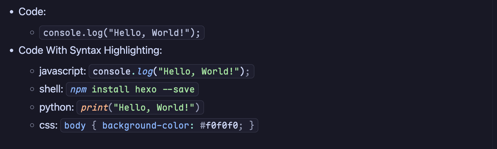
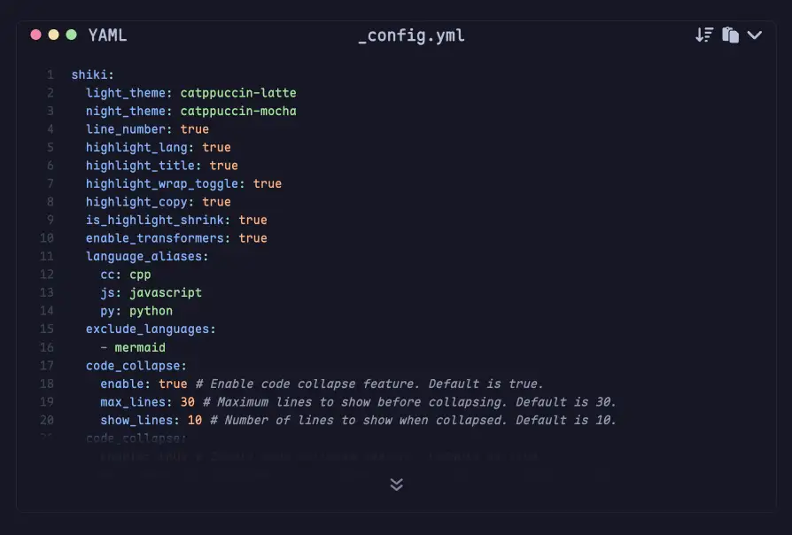
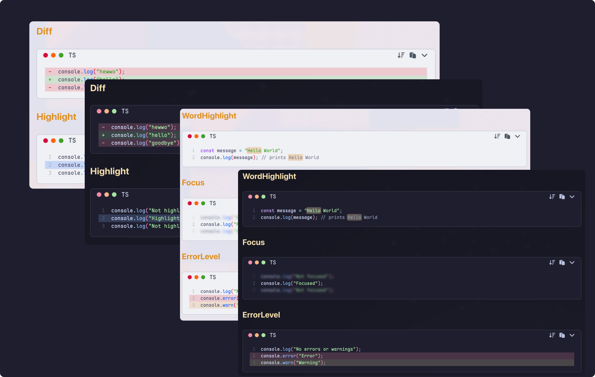

# markdown-exit-shiki

A markdown-exit plugin that provides syntax-highlighted code using Shiki, supporting both inline code and code blocks.

## Install

```shell
bun i shiki
bun i markdown-exit-shiki
```

## Features

### Inline Code

Use the following syntax to highlight inline code:

```markdown
`{js} console.log("Hello, World!");`
```



### Code Blocks

Standard markdown code blocks are also supported:

````markdown
```js
console.log("hello");
```
````

### Multiple Themes

You can configure different themes for light mode, dark mode etc.

To switch between themes, you can use CSS variables along with one of the following strategies:

- `data-theme="dark"` or `data-theme="night"`
- `class="dark"` or `class="night"`

Here is a demonstration of theme switching in my [blog](https://vluv.space):


## Options

### General

| Option              | Type                     | Default       | Description                                                              |
| ------------------- | ------------------------ | ------------- | ------------------------------------------------------------------------ |
| `exclude_languages` | `string[]`               | `['mermaid']` | List of languages to exclude from syntax highlighting.                   |
| `language_aliases`  | `Record<string, string>` | `{}`          | A map of custom language aliases to standard Shiki language identifiers. |

### Themes

If you want to use different themes for light mode, dark mode, and Tokyo Night mode, you can configure them here.

```js
{
  themes: {
    light: 'catppuccin-latte',
    dark: 'catppuccin-mocha',
    tokyo: 'tokyo-night'
  }
}
```

The plugin may emit spans like:

```html
<span style="color:#1E66F5;--shiki-dark:#89B4FA;--shiki-tokyo:#7AA2F7"
  >name</span
>
```

Supported themes listed at [Shiki Themes](https://shiki.style/themes)


### Code Collapse

Configuration for collapsible code blocks. When enabled, code blocks that exceed a certain number of lines will be collapsed by default, with an option to expand and view the full code.

| Option       | Type      | Default | Description                                           |
| ------------ | --------- | ------- | ----------------------------------------------------- |
| `enable`     | `boolean` | `true`  | Enable code block collapsing.                         |
| `max_lines`  | `number`  | `20`    | Maximum number of lines before collapse is triggered. |
| `show_lines` | `number`  | `20`    | Number of lines to show when collapsed.               |



### Toolbar

Configuration for toolbar items in code blocks.

| Option       | Type      | Default | Description                    |
| ------------ | --------- | ------- | ------------------------------ |
| `lang`       | `boolean` | `true`  | Show language name in toolbar. |
| `title`      | `boolean` | `true`  | Show title in toolbar.         |
| `wrapToggle` | `boolean` | `true`  | Show line wrap toggle button.  |
| `copyButton` | `boolean` | `true`  | Show copy button.              |

From the left to right: language name, title, wrap toggle button and copy button.


## Transformers[^1]

When using the `transformers` option, you can specify:

- `'all'` - Enable all transformers (default)
- Or individual transformer names:
  - `compact-line-options`
  - `meta-highlight`
  - `meta-word-highlight`
  - `notation-diff`
  - `notation-error-level`
  - `notation-focus`
  - `notation-highlight`
  - `notation-word-highlight`
  - `remove-line-break`
  - `remove-notation-escape`
  - `render-whitespace`
  - `colorized-brackets`



### Style to Class Transformer

Configuration for transforming inline styles to CSS classes.

| Option            | Type      | Default     | Description                           |
| ----------------- | --------- | ----------- | ------------------------------------- |
| `enable`          | `boolean` | `false`     | Enable style-to-class transformation. |
| `class_prefix`    | `string`  | `'_sk_'`    | Prefix for generated CSS classes.     |
| `css_output_path` | `string`  | `undefined` | Output path for generated CSS file.   |

What this does:

- When enabled, inline `style` attributes produced by Shiki are transformed into unique class names.
- The class names are generated from a hash of the style object; use `class_prefix` to set a custom prefix for those class names.
- A CSS file containing these generated class rules will be written to the `css_output_path` if specified. Ensure to include the generated CSS file in your HTML.

Here is an example of the difference in output

```css
/* without style_to_class */
<span
  style="
    color: #d20f39;
    --shiki-light-font-style: italic;
    --shiki-dark: #f38ba8;
    --shiki-dark-font-style: italic;
    --shiki-tokyo: #c0caf5;
    --shiki-tokyo-font-style: italic;
  "
>
  Italic
</span>

/* with style_to_class */
<span class="_sk_1a2b3c">Italic</span>
```

This feature can help reduce HTML size, improve caching, and make it easier to customize styles via CSS.

[^1]: Visit https://shiki.matsu.io/guide/transformers#transformers for more details on each transformer.